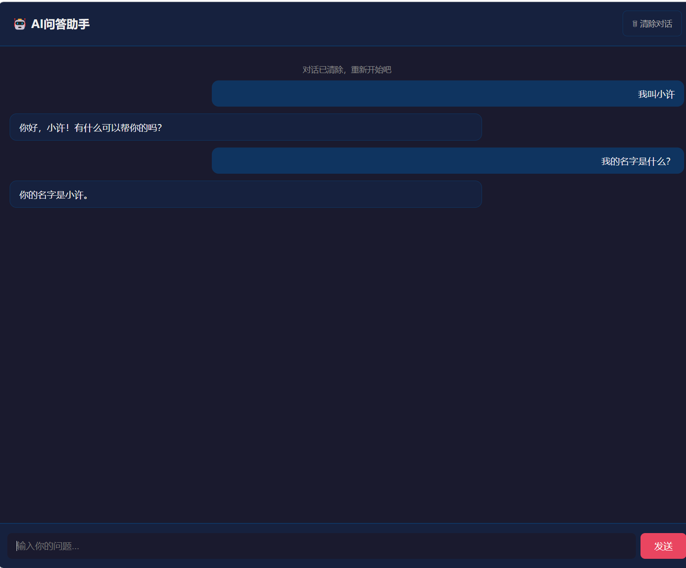

# AI智能问答助手

基于 Flask + DeepSeek API 的网页版 AI 问答应用。

## 功能

- 浏览器端与 AI 实时对话
- **多轮对话记忆** — AI 能记住你之前说过的话，实现上下文连贯对话
- **清除对话** — 一键重置聊天记录，开始新话题
- 深色主题聊天界面
- AI 思考状态提示
- 支持回车键发送消息

## 截图



> 演示：用户说"我叫小许"后，AI记住了名字，后续对话中正确回答"你的名字是小许"。

## 技术栈

- **后端**: Python · Flask · Session
- **AI**: DeepSeek API (OpenAI 兼容接口)
- **前端**: HTML · CSS · JavaScript (原生)

## 快速开始

### 1. 安装依赖

```bash
pip install flask openai
```

### 2. 配置 API Key

方式一：设置环境变量（推荐）

```bash
# Windows CMD
set DEEPSEEK_API_KEY=sk-your-key-here

# Windows PowerShell
$env:DEEPSEEK_API_KEY="sk-your-key-here"
```

方式二：直接在 `app.py` 中替换

```python
API_KEY = "sk-26691fec685f44e5b6117f909ccf2512"
```

申请地址：https://platform.deepseek.com

### 3. 运行

```bash
python app.py
```

浏览器打开 http://127.0.0.1:5000 即可使用。

## 核心功能说明

### 多轮对话记忆

使用 Flask Session 存储对话历史，AI 能记住上下文：

```
你：我叫小明
AI：你好小明！
你：我叫什么名字？
AI：你叫小明。
```

### 清除对话

点击右上角「清除对话」按钮，即可重置聊天记录，AI 会忘记之前的内容。

## 项目结构

```
ai-chat-assistant/
├── app.py           # 主程序（Flask服务 + API调用 + Session管理）
├── .gitignore
└── README.md
```

## License

MIT
